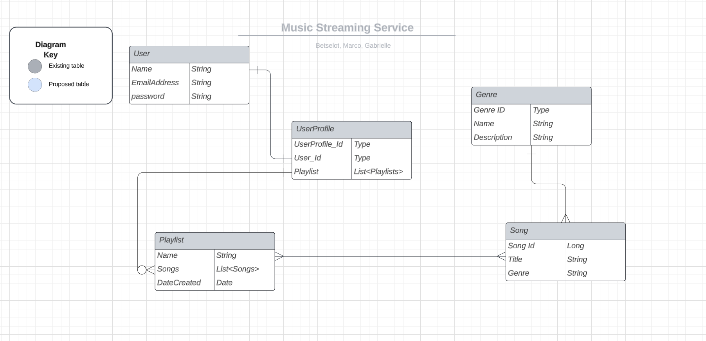

# Music Streaming API: Monolithic Backend with Spring Boot

## Description

This project is focused on developing a Music Streaming API that implements user profiles, music categorization, and personalized playlists. The Music Streaming API is designed to incorporate user profiles. This means that users of the music streaming service will have their own personalized accounts. The API will implement a system for categorizing music, by organizing songs into multiple genres, and playlists. This categorization is important for enabling users to explore and discover music in alignment with their preferences. In addition, the API allows users to create and manage their own playlists. Users will have the ability to curate their own playlists, adding, updating and removing songs based on their preferences. Personalized playlists enhance the user experience by allowing individuals to create a customized collection of songs tailored to their specific preference. 

Moreover, this project employs a monolithic backend that uses Spring Boot framework. It integrates key modules such as Spring Security and JWT tokens, enabling secure user authentication. In order to manage data effectively the project also encompasses implementation of CRUD (Create, Read, Update, Delete) operations. The application utilizes an in-memory H2 database and runs on the Tomcat server. Lastly, Open API is employed to document endpoints for better understanding and utilization.

## Development Approach
Our team actively pursued an efficient and secure development strategy, dividing our 
tasks based on different models. Our approach, shaped by these distinct measures, 
enabled us to craft an application that is both secure and efficient, with a well-structured foundation. 
We maintained a strong focus on our goals, quality standards, and project objectives through ongoing communication
and daily progress checks. Here's a detailed look at the specific steps we took:
- Roles and Responsibilities: We designated specific team members to focus on distinct models such as User, Playlist, Security, Songs, and Genre. 
- Daily Stand-ups: We instituted a daily goal-setting routine, defining both team progress objectives and project milestones. This proactive approach ensured steady progress and alignment with project goals.
- Incorporating driver and navigator roles when debugging and solving problems.
- Use Git branches for project development: This strategy allowed us to work on separate features or models without code conflicts, facilitating a smooth development process.
- Follow the KISS and DRY principles.
- Conform to the MVC design pattern with separate controllers and services.
- Implement TDD using mockMvc for controller unit tests and Cucumber with Rest Assured for service class testing, for each end points.
- Documented each method using doc strings and inline comments.

# User Stories

As a User, I want to be able to create my own playlists, so I can curate my own collection of music.

As a User I want to be able to search for songs by title, artist, or genre, so I can easily find the music I want to listen to.

As a User, I want to have a user profile that I can securely login to where I can view my  playlists.

As a User, I want to see information about the currently playing song, including its title, and artist.

As a User, I want to be able to edit my playlist by adding and removing songs.

## MVC Design Pattern
***

## Entity Relationship Diagram (ERD)
***

# Dependencies
***

  
 Spring Boot Dependencies 

- Spring Boot Starter Data JPA
- Spring Boot Starter Security
- Spring Boot Starter Web
- Spring Boot Starter Web Services
- Spring Boot DevTools (scope: runtime, optional: true)
- Spring Boot Starter Test (scope: test)
- Spring Security Test (scope: test)
- Spring Boot Starter OAuth2 Resource Server

 

 -- and  -- 

  
 Testing Dependencies 

- JUnit: 4.12 (scope: test)
- Cucumber Java: 6.8.1 (scope: test)
- Cucumber JUnit: 6.8.1 (scope: test)
- Cucumber Spring: 6.8.1 (scope: test)
- JUnit Jupiter API: 5.10.0 (scope: test)
- Mockito JUnit Jupiter: 4.5.1 (scope: test)
- Hamcrest: 2.2 (scope: test)
- Mockito Inline: 4.10.0 (scope: test)
- Rest Assured (scope: test, excluding groovy-xml)

 

  
 H2 Dependency 

- H2 Database (scope: runtime)

  
 JWT Dependencies 

- jjwt-api: 0.11.5
- jjwt-impl: 0.11.5 (scope: runtime)
- jjwt-jackson: 0.11.5 (scope: runtime)

 

  
 OpenAPI Dependency 

- Springdoc OpenAPI UI: 1.6.12

## API Endpoints
***

  
 <b>User Endpoints</b>

| HTTP Methods | Endpoint URL                         | Functionality           | Access    | 
|--------------|--------------------------------------|-------------------------|-----------|
| POST         | `/auth/users/register/`              | Register a new user     | public    |
| POST         | `/auth/users/login/`                 | Login a registered user | public    |
| PUT          | `/auth/users/{userId}`                       | Update a User           | private   |
| GET          | `/auth/users/{userId}`                       | Get a User by Id        | private   |
| DELETE       | `/auth/users/{userId}/`               | Delete a User           | private   |

  
 <b>Song Endpoints</b>

| HTTP Methods | Endpoint URL                         | Functionality      | Access  | 
|--------------|--------------------------------------|--------------------|---------|
| GET          | `/api/songs`              | Get all songs      | private |
| GET          | `/api/songs/{songId}`                 | Get a song by Id   | private |
| GET          | `/api/songs/Genre/{genreId}`                       | Get songs by Genre | private |

  
 <b>Playlist Endpoints</b>

| HTTP Methods | Endpoint URL                         | Functionality             | Access  | 
|--------------|--------------------------------------|---------------------------|---------|
| GET          | `/api/playlists/`              | Retrieve a list of all playlists.           | private |
| GET          | `/api/playlists/{playlistId}/`                 | Retrieve a playlist by Id | private |
| GET          | `/api/playlists/{playlistId}/songs/`                       | Retrieve all songs in a playlist by ID.      | private |
| PUT          | `/api/playlists/{playlistId}/`              | Update an existing playlist by ID.          | private |
| POST         | `/api/playlists/`                 | Create a new playlist.        | private |
| POST         | `/api/playlists/{playlistId}/songs/{songId}/`                       | Add a song to a playlist by specifying both playlist and song IDs.        | private |
| DELETE       | `/api/playlists/{playlistId}/`                 | Delete an existing playlist by ID.         | private |
| DELETE       | `/api/playlists/{playlistId}/songs/{songId}/`                       | Remove a song from a playlist by specifying both playlist and song IDs.        | private |

### Challenges
  - We faced a significant challenge with the project when encountering a "Token returning null" issue during the DeleteUser test, 
  specifically in the authentication portion. The error message indicated "Authentication failed" and highlighted that the JWT 
  token was invalid, resulting in a null value. 
    - To overcome this issue, we took several steps to refactor and debug the code. First, 
we refactored the getJWTKey() method to ensure that it correctly obtained the JWT key by sending a POST request to the authentication 
endpoint. I ensured that the request body included the necessary user credentials. 
    - Additionally, we made changes to the iCreateAnAccount() 
method to create a user account successfully. This change was essential for generating a valid user ID for the subsequent deletion.
    - In the iDeleteTheUser() method, we modified the code to extract the user ID from the response and use the JWT token obtained earlier to 
authorize the deletion request. This resolved the authentication issue. 
    - Finally, in the theUserAndUserProfileGetsDeleted() method, we 
asserted that the HTTP response code was 200 to ensure that the user and user profile were deleted successfully. By implementing these 
code changes and debugging techniques, we were able to overcome the challenge and ensure that the DeleteUser test functioned correctly.

- While applying TDD to test controllers, we faced some challenges when utilizing the traditional mockMVC testing method. Mocking the behavior of controllers can sometimes be complex, leading to difficulties in writing effective unit tests. To address these challenges, we decided to take an alternative testing approach. Instead of relying on mockMVS, we decided to implement Cucumber testing. Cucumber is a testing framework that supports Behavior Driven Development(BDD). By choosing Cucumber testing, we shifted the focus from unit testing the controllers to testing the behavior of the entire application. This approach helps ensure that the different components of the system work together seamlessly to deliver the expected functionality. It additionally offers a more clear and thorough understanding of how the application functions in real-world situations.

- We faced a challenge when implementing  MockMVC testing to the playlistService. Everytime we tried to run the tests we would get a '@Mock params are null' error. This caused the test to automatically fail.
    - First attempt at fixing the issue was running debug and rewriting the test to see if the issue was in how the text was executed.       
    - In the end with help from [Suresh Sigera](https://git.generalassemb.ly/sureshmelvinsigera), our instructor, We were able to figure out that we had a couple processes we forgot to mock which caused it to fail.
    - We also noticed that there were more efficient ways to test the service, so we added more assertions.
  
# Acknowledgments

### Betselot Bezabeh

 

### Gabrielle Handy

 

### Marco Gallegos

